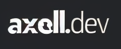

# axell.dev

### My blog

Blog is available at [axell.dev](https://blog.axell.dev).

## ♟️ Specs

My blog hosted on cloudflare pages and generated with [Hugo](https://gohugo.io/).
The theme I am using is [blowfish](https://github.com/nunocoracao/blowfish)

## ℹ️ About

I made post about how I recetly migrated from ghost to hugo, you can read it [here](https://blog.axell.dev/posts/why-i-migrated-from-ghost-to-hugo-and-cloudflare/)

## External Dependencies

This project includes the following external dependencies:

- **Theme Submodule**: Located in the `theme` directory, this submodule is licensed under the MIT License. More details can be found in the submodule's repository [here](https://github.com/nunocoracao/blowfish?tab=MIT-1-ov-file)
