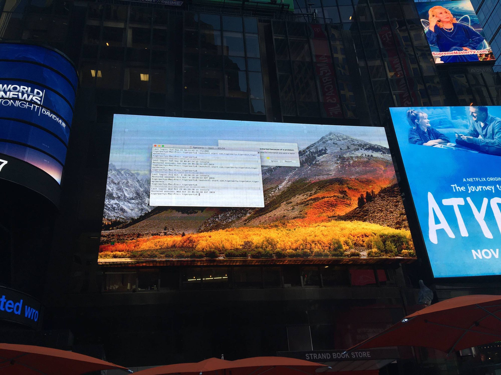
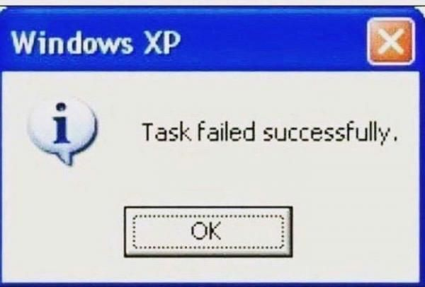

This could happen some system error which forced system reboot (error message in the middle). If you haven't seen this message and you are mac user_.... you are lucky._

AnywayInteresting fact that some of these commercial displays are running on macOS. I mean you see BSOD image every showing blue screens aka windows death or linux kernel panics showing crushed commercial systems running on linux but hey there are system running on macOS. I was personally so surprised that there are some commercials screen running on mac that I need to know more. And after some diging I had find out some info.

There is actually ver simple reason for that. Take a look for another image:

My guess it's same place but this image has terminal on the screen. And if you look closer you can see some data from the _shell_.

For example you can see the username inside terminal which is **tigerparty**.

[Tigerparty](https://www.thetigerparty.com/) is actually company that sells displaying  commercials on billboards. This company is using their own system called [GoTiger](https://www.thetigerparty.com/product). The system suppose to work as commercial advertising or retail digital displays. Shocking I know - commercial company. No one expected that! But wait I can finally explain why they use macs instead of the usual windows/linux solution like we see elsewhere.

Based on the information from their website:

> Ultra High Quality Specs:
> Native 4K @60FPS with Apple lossless ProRes 422HQ or Uncompressed animation codec

...this company decided to sell their commercial services using mac computer based on their hardware specs. Also note that this is US where apple is quite popular.

So yeah the reason is resolution, but still for me it was big surprised that even macOS be used for everyday commercial displaying.

Funny thing is that even though commercial for the advertised product failed (even though they apple should be happy), they still could somehow advertised themselves. I sure I am not the only who was interested enough to dig more about who they are. So yeah always name you username in shell by your company name. It could be someday very helpful.

