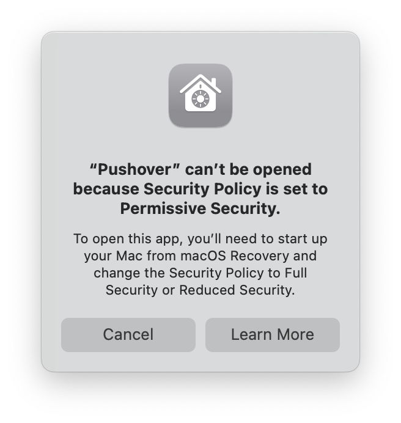

So if you read my blog, recently I decied to give a go to Yabai. For those who don't know Yabai is a tiling window manager for macOS controlled with super usefull shortcuts. Feel free to read more about my post here: [Yabai - tiling window manager for macOS](/posts/yabai-guide-2024).

Now to be able to use the full potential of Yabai, I had to disable SIP (System Integrity Protection) on macOS. This is a security feature that protects the system from malicious software. It's a good thing to have it enabled, but for some software like Yabai, you need to disable it (Yabai needs it so it can control windows and other stuff with Dock system app).
And after disabling the SIP I discovered the unpleasant surprise.

## The unpleasant surprise

It's very high chance that same as me you have the Mac or Macbook with M chip inside. These machines and great, powerfull and engergy efficient. Great thing about them is that they use same CPU architecture as iPhone and iPad. This means that you can run iOS apps on your Mac. There are few apps I use are actually iOS apps ported to mac. That can be very usefull let's say for app like pushover, which is iOS app that I use for notifications on my Mac. If I use it on my Mac, I pay only for subscription that I use for iOS/iPadOS devices. So it's a win-win situation.

_However_

If you disable SIP on your Mac, you can longer use these apps. Why? Because these iOS Apps are encrypted by FairPlay, which requires the Secure Enclave to decrypt the executable before running. Problem is, the Secure Enclave is the same processor that enforces SIP and it refuses to decrypt unless SIP is disabled.

So in simple terms, when you disable SIP, you can't no longer use the iOS apps on your Mac.

## Who to blame?

In this case I blame Apple. I think it's very simple since they could create API endpoint to access the window manager to use 3rd party apps like Yabai to controll windows on macOS. Apple is well know for closing their ecosystem all the time but I think in this case user should be able to use their own. It's like choosing the default browser we uses should have free choice and not be forced to use the simple Apple way. It sucks that we have to use such a workaround just to use simple shortcuts to controll windows on macOS.

Hopefully in the future we will see some changes in this area as Apple seems to be more open to changes in their OS to make it more choices in their [products](https://www.theregister.com/2024/08/24/apple_eu_browser_defaults/)

## Why not to just use yabai with SIP enabled?

It's true that you can use Yabai with SIP enabled. However you will not be able to use all the features that Yabai offers as noted in my post about yabai. But yes this is also of the options you have right now. Just follow these steps and you will be able to use Yabai with SIP enabled:

  1. Uninstall yabai and skhd: `brew uninstall yabai skhd`
  2. Poweroff your Mac and if you have macbook with M chip just hold the power button for 10 seconds
  3. Click on options and after loging your account open Terminal.app
  4. Run the following command: `csrutil enable`
  5. Reboot your Mac
  6. Install yabai and skhd again: `brew install yabai skhd`
  7. Follow the steps in my post about yabai to configure it

You are done but note again some features will not work with SIP enabled.

## I am not going back

While SIP is a great security feature for most users, for me it's a deal breaker. I like yabai, I use it daily, and for me, it has boosted productivity so much that I decided to keep using it with SIP disabled but to sacrifice all my iOS apps on my M3 MacBook.

I still have some options. One is find a way to install these apps on mac with brew, use them as web apps since Safari has the option to export a web app to a desktop app, or just use them on my iPhone/iPad. I will see what I will do, but for now, I am happy with my decision.

## Bonus

There is one option I did not try yet and that is to fully disable SIP. In my tries I partially disabled SIP as the guide for Yabai suggested. I will try to fully disable it and see if that will help. I will update this post if I find something new. I did not give up yet, and I will try to find a way to use both Yabai and iOS apps on my Mac with SIP disabled.

---

Good luck, stranger. If you find a better way, please reach out to me. I would be happy to hear from you.
